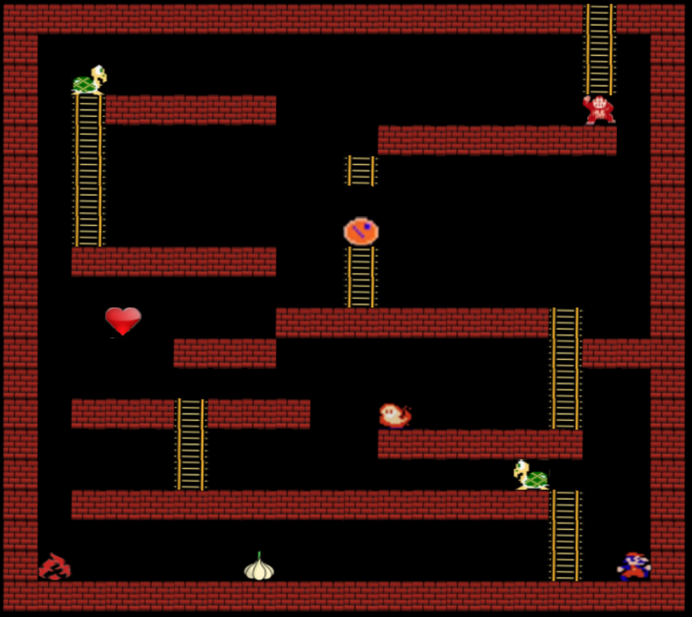

# WonkyKong
C++ Game made with OpenGL Utility Toolkit as part of CS-32 Project on Inheritance and Polymorphism.

WonkyKong is a 2D game where the player must avoid both static and moving obstacles to navigate to Kong. The player can jump, climb ladders, or collect goodies for special abilities. The player can also destroy enemies with burps.

## Screenshot of Gameplay
